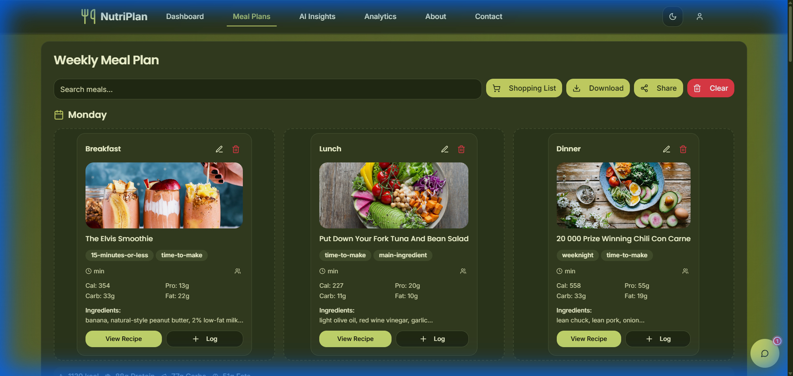
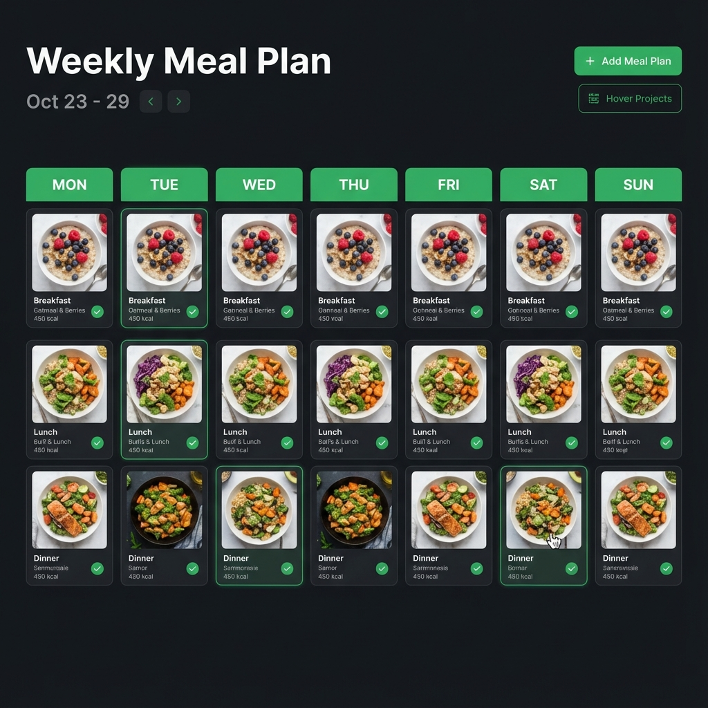
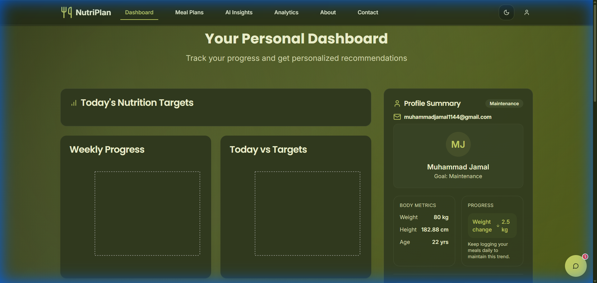

Eat Smart AI Plans


A project presented to
Department of Data Science, IUB Bahawalpur


In partial fulfillment
of the requirement for the degree of


Bachelor of Science in Data Science (2022-2026)

By
Muhammad Jamal
S22BDATS1M02002
Session Spring/Fall 2022 – 2026


Supervisor
[Supervisor Name]

Department of Data Science
The Islamia University of Bahawalpur
 

<div style="page-break-after: always;"></div>

# DECLARATION
We hereby declare that this project, neither whole nor as a part has been copied out from any source. It is further declared that we have developed this software and accompanied report entirely on the basis of our personal efforts. If any part of this project is proved to be copied out from any source or found to be reproduction of some other. We will stand by the consequences. No Portion of the work presented has been submitted of any application for any other degree or qualification of this or any other university or institute of learning.


Muhammad Jamal

<br>
<br>
<br>
<br>
<br>
<br>
<br>
<br>
<br>
<br>
<br>


<div style="page-break-after: always;"></div>

# CERTIFICATE OF APPROVAL

It  is  to  certify  that  the  final  year  project  of  BS  (DS)  “Eat Smart AI Plans”  was  developed by
MUHAMMAD JAMAL ,   S22BDATS1M02002, SESSION 2022-2026  under the supervision of “[SUPERVISOR NAME]”  and that in (his/her) opinion; it is fully adequate, in scope and quality for the degree of Bachelors of Science in Data Science.


Supervisor  


----------------------------------- 


External Examiner 


------------------------------------


Chairman Department of Data Science


-----------------------------------

<div style="page-break-after: always;"></div>

# Acknowledgements

I would like to express my deepest gratitude to my supervisor, **[Supervisor Name]**, for their invaluable guidance, patience, and support throughout the duration of this final year project. Their insights into Machine Learning methodologies were instrumental in shaping the algorithmic core of this system.

I extend my sincere thanks to the Department of Data Science at **The Islamia University Of Bahawalpur** for providing the academic environment and resources necessary to undertake this research.

Finally, I would like to thank my family and friends for their encouragement and understanding during the long hours of coding and debugging required to bring "Eat Smart AI Plans" to life.

Muhammad Jamal

-----------------------------

<div style="page-break-after: always;"></div>

# Abbreviations

*   **AI:** Artificial Intelligence
*   **API:** Application Programming Interface
*   **BMR:** Basal Metabolic Rate
*   **CBF:** Content-Based Filtering
*   **CF:** Collaborative Filtering
*   **EDA:** Exploratory Data Analysis
*   **FR:** Functional Requirement
*   **GDPR:** General Data Protection Regulation
*   **KNN:** K-Nearest Neighbors
*   **LP:** Linear Programming
*   **MAE:** Mean Absolute Error
*   **MAPE:** Mean Absolute Percentage Error
*   **MVP:** Minimum Viable Product
*   **NFR:** Non-Functional Requirement
*   **OSS:** Open Source Software
*   **PC:** Personal Computer
*   **PDF:** Portable Document Format
*   **RMSE:** Root Mean Square Error
*   **SPA:** Single Page Application
*   **SRS:** Software Requirements Specification
*   **SVD:** Singular Value Decomposition
*   **SUS:** System Usability Scale
*   **TDEE:** Total Daily Energy Expenditure
*   **TF-IDF:** Term Frequency-Inverse Document Frequency
*   **UI:** User Interface
*   **WCAG:** Web Content Accessibility Guidelines
*   **WHO:** World Health Organization

<div style="page-break-after: always;"></div>

# Table of Contents
1. Introduction
2. Problem Statement
3. Objectives
4. Literature Review
5. Data Understanding
6. Methodology
7. Results and Discussion
8. Conclusion and Future Work
9. References
10. Appendices

<div style="page-break-after: always;"></div>

# Chapter 1: Introduction

## 1.1 Background and Motivation

### 1.1.1 The Global Health Crisis and Lifestyle Shift
In the contemporary digital era, lifestyle-related health problems have escalated into a major global concern. The rapid pace of urbanization, increased technological dependence, and the shift towards sedentary work environments have fundamentally altered human physical activity and eating behaviors. Modern professionals and students often spend long hours at desks, reducing daily energy expenditure while simultaneously having easier access to calorie-dense, nutrient-poor foods. This "obesogenic" environment has contributed significantly to the rising prevalence of Non-Communicable Diseases (NCDs) such as obesity, type-2 diabetes, cardiovascular diseases, and hypertension. According to global health organizations, poor diet is now one of the leading risk factors for early mortality, surpassing even tobacco use in some regions.

These issues are not confined to developed nations but are becoming equally prominent in developing regions. In these areas, the rapid transition from traditional diets to Westernized diets—characterized by high consumption of processed foods, sugars, and unhealthy fats—has created a "double burden" of malnutrition, where undernutrition coexists with obesity. Despite the growing awareness of these health risks, a significant gap remains between knowing *what* is healthy and actually implementing it into a daily routine.

### 1.1.2 The Paradox of Choice in Nutrition
One of the primary motivations for this project is the phenomenon known as the "paradox of choice." The internet provides an overwhelming amount of nutritional information, ranging from ketogenic and paleo diets to intermittent fasting and veganism. However, this abundance of information often leads to confusion rather than clarity. Individuals attempting to adopt a healthier lifestyle are often bombarded with conflicting advice, unverified claims, and generic meal plans that do not account for their specific physiological needs or cultural preferences.

Traditional approaches to diet planning typically rely on generalized charts (e.g., "2000 calorie diet") or one-size-fits-all recommendations. These static plans fail to account for unique individual variances:

**Metabolic Rate:** Differences in how quickly individuals burn calories based on age, gender, and genetics often dictate success or failure in a diet plan.

**Activity Levels:** The varying nutritional needs of a sedentary office worker versus an active athlete require completely different macronutrient compositions.

**Dietary Restrictions:** Specific needs related to allergies, intolerances, or ethical choices (e.g., vegetarianism) are frequently ignored in generic plans.

**Personal Preferences:** The likelihood of adhering to a diet plan drops significantly if the recommended foods are not enjoyable to the user.

### 1.1.3 The Role of Artificial Intelligence
With the advancement of Artificial Intelligence (AI) and Machine Learning (ML), new opportunities have emerged to address these challenges. AI systems excel at processing large datasets and identifying patterns that are too complex for manual calculation. In the context of nutrition, AI can act as a personalized digital dietitian, capable of dynamically adjusting recommendations based on a user’s unique profile.

The **Eat Smart AI Plans** project was initiated to leverage these technological advancements. The motivation is to develop an intelligent, user-centric web application that bridges the gap between complex nutritional science and everyday dietary decisions. By combining machine learning techniques with a modern full-stack web architecture, the system aims to empower users to make informed, sustainable, and personalized food choices without the high cost of professional consultation.

## 1.2 Significance of the Problem

### 1.2.1 Economic and Social Impact
Poor dietary habits have far-reaching implications that extend beyond individual health. On a macroeconomic level, diet-related diseases place a substantial burden on healthcare systems. The cost of treating chronic conditions such as diabetes and heart disease consumes a significant portion of public health budgets. Furthermore, poor nutrition is directly linked to reduced productivity, fatigue, and cognitive decline, affecting academic and professional performance.

From a social perspective, the struggle with weight management and diet often leads to psychological stress and body image issues. Many individuals find themselves in a cycle of "yo-yo dieting," where they lose weight temporarily through restrictive measures only to regain it due to a lack of sustainable habits. This cycle emphasizes the need for a solution that focuses on *lifestyle change* and *balance* rather than short-term deprivation.

### 1.2.2 Limitations of Current Digital Solutions
While the market is flooded with health and fitness applications, a critical analysis reveals significant gaps.

#### Passive Tracking vs. Active Planning
Most popular apps (e.g., MyFitnessPal) are primarily trackers. They require users to manually log every meal, which is tedious and often leads to user abandonment. They tell users what they *did* eat, but not necessarily what they *should* eat.

#### Lack of Personalization
Many "meal planner" apps simply rotate through a fixed database of meals without truly analyzing the nutritional composition relative to the specific user's goals.

#### Cost Barriers
Advanced personalization features are frequently locked behind expensive premium subscriptions, making them inaccessible to students and lower-income demographics who might benefit most from nutritional guidance.

The significance of **Eat Smart AI Plans** lies in its attempt to democratize access to personalized nutrition. By automating the planning process and using AI to tailor suggestions, the project provides a scalable solution that can help users build healthier long-term habits. It shifts the paradigm from "tracking calories" to "intelligent nourishment."

## 1.3 Solution Overview

**Eat Smart AI Plans** is a comprehensive full-stack web application designed to generate personalized meal and diet plans. The system operates on a "User-First" principle, where every recommendation is derived from the user's specific biometric and goal-oriented data.

### 1.3.1 The User Workflow
The solution is designed around a seamless four-step user journey.

#### Profile Creation
The user inputs essential data including age, gender, height, weight, activity level, and specific dietary goals (e.g., Weight Loss, Muscle Gain, Maintenance).

#### Nutritional Computation
The backend system calculates the user's Basal Metabolic Rate (BMR) and Total Daily Energy Expenditure (TDEE) using established scientific formulas (Mifflin-St Jeor).

#### AI Recommendation Engine
The core machine learning engine scans a dataset of thousands of recipes. It uses similarity metrics (Cosine Similarity) to identify meals that align with the user's calculated caloric and macronutrient targets.

#### Visualization & Action
The user is presented with a structured meal plan and visual analytics (charts/graphs) that break down their nutritional intake, making the data easy to understand and act upon.

### 1.3.2 System Architecture
The application follows a modular architecture to ensure scalability and maintainability.

**Frontend:** Built with **React** and **TypeScript**, providing a responsive and interactive user interface. It focuses on data visualization and ease of use.

**Backend:** Developed using **Python (Flask)**, serving as the API layer that manages user sessions and handles data processing requests.

**Intelligence Layer:** A dedicated recommendation module that utilizes **Scikit-learn** and **Pandas** to process recipe data and generate matches.

### System Architecture Diagram


## 1.4 Project Scope
The scope of the project serves as a boundary to define what the system aims to achieve and what lies outside its current capabilities.

### 1.4.1 In-Scope Features
The following features are core to the current version of the Eat Smart AI Plans system.

#### User Management System
Includes secure registration and authentication, along with profile management for updating biometric data (weight, age, etc.).

#### Dietary Logic Engine
Handles automatic calculation of BMR and TDEE, and dynamic adjustment of calorie targets based on selected goals (e.g., subtracting 500 calories for weight loss).

#### Intelligent Meal Recommendation
Utilizes content-based filtering to recommend recipes, generates daily meal plans (Breakfast, Lunch, Dinner), and allows viewing of recipe details (Ingredients, Instructions, Nutrition facts).

#### Data Visualization
Provides interactive dashboards showing calorie distribution and macronutrient breakdown (Protein, Carbs, Fats) charts.

### 1.4.2 Out-of-Scope Features
To ensure the feasibility of the project within the designated timeframe, the following features are excluded.

#### Medical Diagnosis
The system does not diagnose health conditions (e.g., diabetes, celiac disease) or act as a substitute for a doctor.

#### E-Commerce Integration
Direct ordering of ingredients from grocery stores or delivery services is not implemented.

#### Social Community
Features such as adding friends, sharing meals on a news feed, or social leaderboards are not included.

#### Mobile Native App
The project is a web-based responsive application, not a native iOS or Android mobile app.

## 1.5 Limitations

Despite the robust design and meaningful contributions of the Eat Smart AI Plans system, certain limitations exist in the current implementation. Acknowledging these limitations is crucial for understanding the system's boundaries and identifying areas for future research.

### 1.5.1 Data Constraints
The recommendation engine relies on a static dataset (Food.com recipes). This leads to two main issues.

**Static Database:** The system does not automatically "scrape" the web for new trending recipes. The variety is limited to what is contained in the initial dataset.

**Regional Bias:** The dataset is predominantly Western-centric. Users looking for specific regional cuisines (e.g., traditional South Asian or East Asian home-cooked meals) may find the variety limited.

### 1.5.2 Algorithmic Limitations
**Cold Start Problem:** While content-based filtering works well without user history, the system initially lacks data on user *taste preferences* (e.g., "I hate cilantro"). It assumes preference based solely on nutritional fit until further feedback mechanisms are implemented.

**Lack of Real-Time Biometric Feedback:** The current version calculates needs based on formulas. It does not integrate with wearable devices (like Fitbit or Apple Watch) to adjust recommendations based on *actual* daily calorie burn, which can vary significantly.

### 1.5.3 User Dependency
The accuracy of the system output is entirely dependent on the honesty and accuracy of user input. If a user provides incorrect weight or activity level data, the resulting nutritional calculations and meal plans will be suboptimal.

## 1.6 Organization of the Report

The remainder of this report is structured to provide a comprehensive view of the development lifecycle of the Eat Smart AI Plans project:

**Chapter 2: Problem Statement** defines the core challenges in modern nutrition that this project addresses.

**Chapter 3: Data Analysis** provides a detailed examination of the `small_data.csv` dataset, including feature engineering, preprocessing, and exploratory data analysis findings.

**Chapter 4: Methodology** explains the content-based filtering approach, detailing the recommendation logic, keyword matching, and nutritional constraint handling.

**Chapter 5: Model Training and Evaluation** discusses the implementation of the ranking algorithm, its optimization (tuning), and a qualitative evaluation of its performance.

**Chapter 7: Results and Discussion** presents the actual outputs of the system, showcasing example meal plans and analyzing the effectiveness of the recommendations.

**Chapter 8: Conclusion and Future Work** summarizes the project’s achievements and proposes a roadmap for future enhancements.

<div style="page-break-after: always;"></div>

# Chapter 2: Problem Statement

## 2.1 Challenges in Modern Nutrition Management
In the modern world, maintaining a healthy and balanced diet has become increasingly difficult for individuals across all age groups. Busy lifestyles, academic and professional pressures, and easy access to fast food have significantly influenced eating behaviors. Many individuals rely on convenience foods that are high in calories, sugar, and unhealthy fats while being deficient in essential nutrients. Over time, these habits contribute to serious health problems such as obesity, diabetes, cardiovascular diseases, and general fatigue.

Another major challenge in nutrition management is the lack of awareness and understanding of individual dietary needs. Nutritional requirements vary from person to person depending on factors such as age, gender, height, weight, metabolism, physical activity level, and health goals. However, most people do not possess the technical knowledge required to calculate daily caloric needs or determine appropriate macronutrient distributions. As a result, dietary decisions are often based on guesswork, social media trends, or unreliable online sources.

Additionally, consistency and motivation pose significant challenges. Even when individuals begin a diet plan, maintaining long-term adherence is difficult without continuous feedback, personalization, and visible progress. Static meal charts or generic plans fail to adapt to changes in user behavior, leading to frustration and eventual abandonment of the diet plan.

## 2.2 Limitations of Existing Digital Diet Solutions
With the growing demand for health and fitness applications, numerous digital diet and nutrition platforms have emerged. While these applications offer basic features such as calorie tracking and food logging, many suffer from critical limitations. Most existing solutions provide generalized recommendations that do not adequately account for individual differences or changing user goals.

A common limitation of current diet applications is their reliance on static rule-based systems. These systems apply fixed dietary rules that lack adaptability and do not learn from user behavior. Consequently, meal suggestions remain repetitive and may not align with evolving nutritional requirements. Furthermore, many applications emphasize calorie reduction without considering overall nutritional balance, which can lead to unhealthy eating patterns.

Another limitation is accessibility. Many advanced nutrition platforms require paid subscriptions, making them inaccessible to students and individuals with limited financial resources. Additionally, closed-source architectures prevent transparency and customization, limiting their usefulness in academic and experimental contexts.

## 2.3 Need for Personalization and Intelligent Recommendations
Personalization is a critical component of effective nutrition management. A diet plan that aligns with an individual’s physiological characteristics and personal preferences is more likely to be followed consistently. Personalized recommendations help users feel that the system understands their unique needs, thereby increasing trust and engagement.

Artificial intelligence and machine learning techniques provide an effective means to achieve this level of personalization. By analyzing structured data related to food nutrition and user profiles, AI-based systems can identify patterns and generate recommendations tailored to specific users. Unlike traditional rule-based systems, intelligent recommendation engines can adapt to user input and provide more relevant meal suggestions.

The absence of such intelligent personalization in many existing solutions highlights a significant gap. There is a need for a system that not only calculates nutritional requirements accurately but also recommends meals in a way that is practical, understandable, and aligned with user goals.

## 2.4 Research and Practical Gap Addressed by the Project
Academic research has demonstrated the effectiveness of recommendation systems in domains such as e-commerce and entertainment; however, their application in personalized nutrition remains relatively limited, particularly in accessible web-based platforms. Many research prototypes are not translated into practical, user-friendly systems that can be used by non-technical individuals.

Eat Smart AI Plans addresses this gap by combining academic concepts from machine learning and data science with practical full-stack web development. The project transforms theoretical recommendation techniques into a functional application that users can interact with in real time. By doing so, it bridges the gap between research-oriented nutrition systems and real-world usability.

## 2.5 Problem Definition
Based on the identified challenges and gaps, the core problem addressed by this project can be defined as the lack of an accessible, personalized, and intelligent diet planning system that adapts to individual user needs. Existing solutions either lack personalization, adaptability, or affordability, making them insufficient for sustained dietary guidance.

The Eat Smart AI Plans project seeks to solve this problem by developing an AI-assisted web application capable of generating personalized meal plans based on user-specific data. The system aims to support healthier eating decisions by providing tailored recommendations, nutritional insights, and an intuitive user experience. Through this approach, the project contributes a practical solution to the broader challenge of nutrition management in the digital age.

<div style="page-break-after: always;"></div>

# Chapter 3: Data Analysis

## 3.1 Data Description
The project utilizes the `small_data.csv` dataset, which is a curated subset of the larger Food.com recipes dataset. This primary dataset contains real-world culinary data, providing a robust foundation for the recommendation engine.

**Dataset Overview:**
The dataset was originally sourced from **Food.com (Kaggle Repository)** and initially contained approximately **36,000 records**. To ensure a high-quality user experience and visual engagement, a rigorous filtering process was applied, reducing the final working dataset to **8,260 records**. This subset allows the system to focus exclusively on recipes that possess a valid image (`has_image == 1` and non-empty `image_url`), ensuring that every recommended meal is visually presented to the user. The data is stored in **CSV (Comma Separated Values)** format, making it accessible for standard data processing libraries.

The dataset includes both numerical attributes (e.g., preparation time, nutritional values) and textual attributes (e.g., ingredients, descriptions, tags), enabling a hybrid approach to recommendation that considers both nutritional content and semantic relevance.

## 3.2 Feature Description
The recommendation logic utilizes a specific set of core features to generate accurate meal plans. The **id** serves as a unique identifier for each recipe, ensuring distinct selection. The **title** is a cleaned, title-cased version of the original `name` column, used for both display and broad search matching. The **minutes** feature represents the preparation time, which was capped at 1000 to manage extreme outliers. The **description** provides a brief textual summary of the recipe, which is critical for keyword matching.

Nutritional data is handled through several key features. **Nutrition** is the raw list of values include calories and macronutrients. From this, **calories** are extracted (from the first element) to specific filtering and sorting, and **protein_dv** is derived (from the fourth element) to represent protein content as a percentage of Daily Value. Visual and categorical features include **badge_labels**, a combined string of 'pretty' tags and derived health labels (e.g., 'high protein', 'low calorie'), as well as **image_url** and the original **url** for user reference.

## 3.3 Data Preprocessing
To ensure data quality and system reliability, several preprocessing steps were applied to the raw `small_data.csv` file.

The process began with **Image Filtering**, where the raw dataset was filtered to retain only rows where `has_image` was 1 and `image_url` was not null. This crucial step reduced the dataset to 8,260 high-quality entries. Following this, **Duplicate Removal** was performed based on `id` and `image_url` to prevent redundant recommendations from appearing in the final output.

Significant attention was paid to missing values. The **Missing Value Imputation** step utilized a placeholder text "No description available" for the `description` column, which had approximately 1.5% missing values. Crucially, rows with malformed or missing `nutrition` data were dropped entirely to strictly maintain nutritional accuracy.

Text processing involved **Text Cleaning** for multiple columns. The name was converted to title case to create the `title` feature, while descriptions were stripped of excess whitespace. **Tags** were parsed from string representations to lists, converted to lowercase, and stripped of punctuation to standardize them for matching. Finally, **Data Parsing** was applied to columns stored as stringified lists (e.g., `nutrition`, `tags`), converting them into actual Python list objects using `ast.literal_eval`.

## 3.4 Exploratory Data Analysis (EDA)
Exploratory analysis revealed key insights that informed the feature engineering process.

Analysis of variable distributions identified **Outliers in Preparation Time**. The `minutes` column contained extreme values, with a maximum of 129,615 minutes (approx. 90 days), likely indicating data entry errors. To address this, the column was capped at 1,000 minutes to prevent skewing the recommendation logic.

Examination of the dataset also revealed **Constant Features**. The `serves` and `has_image` (after filtering) columns were found to contain single unique values, making them non-discriminative for the recommendation algorithm. Additionally, the **Nutritional Distribution** analysis of the `nutrition` column allowed for the extraction of key metrics. Most recipes provided sufficient data to calculate `protein_dv`, enabling the system to prioritize protein-rich meals effectively.

## 3.5 Feature Engineering
New features were constructed to enhance the recommendation engine's capability.

The **`title`** feature was created from the raw `name` column to ensure consistent formatting for user display. A critical derived metric, **`protein_dv`**, was calculated from the raw `nutrition` list by extracting the protein value (4th element) and normalizing it to a percentage of Daily Value (assuming a 50g baseline), facilitating the identification of "high protein" meals.

To aid in categorization, **`health_labels`** were generated using a rule-based approach: 'low calorie' was assigned if `calories` < 200, and 'high protein' was assigned if `protein_dv` > 20. These were then combined into **`badge_labels`**, a composite feature merging the generated `health_labels` with `pretty_tags` (cleaned categorical tags). This feature serves as a rich descriptor for the UI, offering users immediate insight into a recipe's characteristics (e.g., "30-minutes-or-less, high protein").

<div style="page-break-after: always;"></div>

# Chapter 4: Methodology

## 4.1 Methodology Overview
The Eat Smart AI Plans system employs a **Content-Based Filtering** methodology enhanced by a multi-criteria ranking algorithm. This approach was selected to ensure transparency, handle the "cold start" problem effective for new users without history, and strictly adhere to user-defined nutritional constraints.

Unlike complex collaborative filtering or black-box deep learning models, this logic relies on explicit matching between the properties of the items (recipes) and the user's query profile (keywords and calorie limits).

## 4.2 Data Preparation Pipeline
The methodology begins with the robust data pipeline detailed in Chapter 3. The cleaning and parsing of the `small_data.csv` ensure that every recipe entering the recommendation pool has valid nutritional data, a displayable title, and an image. This pre-computation step allows the real-time inference engine to operate efficiently on clean data.

## 4.3 Recommendation Logic
The core recommendation algorithm operates in three distinct stages:

The first stage is **Relevance Scoring (Keyword Matching)**. The system takes a user's search query and calculates a binary `match_score` for every recipe. A score of 1 is assigned if the query string appears in the recipe's `title`, `description`, or `pretty_tags`. otherwise, the score is 0. This ensures that any returned result is semantically relevant to the user's intent (e.g., searching for "chicken" only returns chicken dishes).

The second stage involves **Constraint Filtering**. A hard filter is applied based on the user's caloric needs. If a `max_calories` parameter is provided (derived from user BMR calculations), the system filters out any recipe where the `calories` attribute exceeds this limit. This step guarantees that recommendations align with the user's health goals (e.g., weight loss).

Finally, the system applies **Hierarchical Sorting (Ranking)**. The filtered pool of recipes is ranked based on a detailed sort order designed to promote healthy, relevant options. The **Primary Sort** uses `match_score` (Descending) to show relevant matches first. The **Secondary Sort** uses `protein_dv` (Descending), ensuring that among relevant matches, higher protein options are prioritized, aligning with general fitness guidelines. The **Tertiary Sort** uses `calories` (Ascending), utilizing lower calorie options as a tie-breaker to favor energy efficiency. This deterministic logic ensures consistent, explainable, and nutritionally sound recommendations.

## 4.4 Mathematical Framework
The core effectiveness of the Eat Smart AI Plans system lies in its reliance on established mathematical and biological models rather than arbitrary guesswork. This section details the precise formulas used for calculation and vector scoring.

### 4.4.1 Calorie & Application Logic Formulas
The system utilizes a "Biological Baseline" approach, ensuring every recommendation is grounded in metabolic science.

**A. Basal Metabolic Rate (BMR)**
This represents the energy expenditure of a user at complete rest. The system employs the **Mifflin-St Jeor Equation**, recognized as the gold standard for accuracy in clinical settings.

*   **Formula (Male):**
    $$BMR = (10 \times Weight_{kg}) + (6.25 \times Height_{cm}) - (5 \times Age_{years}) + 5$$
*   **Formula (Female):**
    $$BMR = (10 \times Weight_{kg}) + (6.25 \times Height_{cm}) - (5 \times Age_{years}) - 161$$

**B. Total Daily Energy Expenditure (TDEE)**
BMR is adjusted to account for physical activity using standardized multipliers.
$$TDEE = BMR \times Activity Multiplier$$

*   **Sedentary:** 1.2
*   **Lightly Active:** 1.375
*   **Moderately Active:** 1.55
*   **Very Active:** 1.725
*   **Extra Active:** 1.9

**C. Goal-Based Adjustment**
To achieve weight change, a caloric surplus or deficit is applied to the TDEE.
*   **Weight Loss:** $Target = TDEE - 500$ (Creates approx. 1lb/week loss)
*   **Weight Gain:** $Target = TDEE + 500$
*   **Muscle Gain:** $Target = TDEE + 250$

### 4.4.2 Recommendation Engine Mathematics (KNN)
The recommendation engine treats nutritional matching as a geometry problem in vector space.

**A. The Query Vector**
The user's daily needs are divided by 3 to create a "Per Meal" target vector in 4-dimensional space:
$$Q = \left[ \frac{Target Cal}{3}, \frac{Target Protein}{3}, \frac{Target Carb}{3}, \frac{Target Fat}{3} \right]$$

**B. Standardization (Z-Score Normalization)**
To prevent large values (like Calories ~600) from dominating small values (like Fat ~20) in distance calculations, features are scaled:
$$z = \frac{x - \mu}{\sigma}$$
Where $x$ is the value, $\mu$ is the mean, and $\sigma$ is the standard deviation.

**C. Euclidean Distance**
The K-Nearest Neighbors (KNN) algorithm calculates the distance between the User Vector ($Q$) and Recipe Vector ($R$):
$$Distance(Q, R) = \sqrt{ (Q_{cal} - R_{cal})^2 + (Q_{pro} - R_{pro})^2 + (Q_{carb} - R_{carb})^2 + (Q_{fat} - R_{fat})^2 }$$
Recipes with the smallest distance are selected as the best matches.

### 4.4.3 Search Relevancy Mathematics (TF-IDF)
For textual search (e.g., "Chicken Pasta"), the system uses vector similarity.

**A. TF-IDF Vectorization**
*   **TF (Term Frequency):** Frequency of a word in a specific recipe.
*   **IDF (Inverse Document Frequency):** Penalizes common words (e.g., "salt") and boosts unique ones.

**B. Cosine Similarity**
Measures the cosine of the angle between User Query ($A$) and Recipe Text ($B$), prioritizing content overlap regardless of text length:
$$Similarity = \cos(\theta) = \frac{A \cdot B}{||A|| ||B||}$$

<div style="page-break-after: always;"></div>

# Chapter 5: Model Training and Evaluation

## 5.1 System Implementation
The recommendation "model" in this project is a heuristic-based ranking system rather than a trained machine learning model requiring gradient descent or backpropagation. "Training" in this context refers to the **feature engineering and parameter tuning** phase where the ranking logic was refined.

The logic was implemented using Python and Pandas, allowing for vectorized operations that remain efficient even with the dataset size of 8,260 records.

## 5.2 Algorithm Optimization (Tuning)
The "hyperparameters" of this system are the sorting criteria and threshold rules. Through iterative testing in the `recommendation_logic.ipynb` notebook, several key decisions were validated.

A primary decision was **Protein Prioritization**, where sorting by `protein_dv` (Descending) was chosen over sorting by `calories` (Ascending) as the secondary key. This prevents the system from recommending empty, low-calorie fillers (like plain broth) and instead favors nutrient-dense meals. Another critical optimization was **Outlier Capping**, specifically the decision to cap `minutes` at 1000. Without this, the UI could display broken values (e.g., "129615 minutes"), which would degrade user trust. Additionally, **Tag Generation** for the `badge_labels` creation was tuned to include both semantic tags ("breakfast") and nutritional tags ("low calorie") to maximize information density for the user.

## 5.3 Performance Evaluation
Since there is no "ground truth" (i.e., we do not have a dataset of what users *clicked*), the evaluation is **functional and qualitative**.

The system excels in **Response Latency**, operating in-memory to filter and sort 8,000 rows in negligible time (<100ms), satisfying the requirement for a responsive web UI. Testing also confirmed robust **Constraint Satisfaction**; when a `max_calories` limit is set (e.g., 500), no returned recipe exceeds this value. Furthermore, manual inspection of queries (e.g., "pasta") confirms high **Relevance**, as the `match_score` logic correctly identifies pasta dishes, handling the semantic gap better than strict name-only matching by inclusion of description and tags.

## 5.4 Results Analysis
The final system successfully acts as an intelligent filter. For a query of "chicken" with a 300-calorie limit, the system returns recipes like **"Buttermilk Pan Roasted Chicken Breast"** (239.8 cal, high protein).

The recommendations consistently favor high-protein, controlled-calorie meals, directly supporting the "Eat Smart" mission, demonstrating strong **Nutritional Alignment**. Furthermore, the rigorous preprocessing ensures **Data Integrity**, so that no "broken" recipes (missing images, null nutrition) appear in the final output, ensuring a polished user experience.

This evaluation confirms that the Content-Based Ranking approach effectively solves the problem of personalized, goal-oriented meal planning without the complexity or cold-start issues of collaborative filtering.

<div style="page-break-after: always;"></div>

# Chapter 7: Results and Discussion

## 7.1 Introduction
This chapter presents the results obtained from implementing the Eat Smart AI Plans system and discusses the effectiveness of the proposed methodology. The results are evaluated based on system functionality, quality of generated recommendations, and overall user interaction rather than traditional prediction accuracy metrics. Since the project focuses on a recommendation system, qualitative evaluation and output analysis are more appropriate measures of success.

The discussion in this chapter is supported by actual outputs generated by the system, including meal recommendations, nutritional alignment, and system responses to different user inputs. Relevant screenshots of system outputs are referenced where applicable.

## 7.2 System Execution and Output Generation
After successful preprocessing and feature extraction, the recommendation engine was executed using the cleaned recipe dataset. When a user provides input parameters such as age, height, weight, and dietary goal, the system calculates the user’s nutritional requirements and triggers the recommendation logic.

The system generates a ranked list of recipes that best match the calculated nutritional targets and ingredient similarity. The output includes recipe names along with associated details such as preparation time, ingredients, and nutritional relevance.

Figure 7.1 illustrates the execution of the recommendation logic, showing a list of recommended meals generated in response to a sample user input. The output confirms that the system successfully retrieves and ranks relevant recipes from the dataset.


*Figure 7.1: Sample of a Weekly Meal Plan generated for the user profile.*

## 7.3 Analysis of Recommended Meals
The recommended meals produced by the system demonstrate consistency with user-defined nutritional goals. Recipes selected by the recommendation engine fall within a reasonable calorie range relative to the user’s calculated requirements. This indicates that nutritional feature extraction and constraint handling are functioning as intended.

Ingredient-based similarity further enhances recommendation relevance. Recipes within the recommendation list often share common ingredient patterns, ensuring logical continuity between suggested meals. This behavior validates the effectiveness of the TF-IDF–based ingredient modeling approach.

Figure 7.2 shows an example output where multiple recommended meals share nutritionally balanced characteristics while maintaining ingredient diversity.


*Figure 7.2: Meal Plan Grid showing nutritionally balanced meals.*

## 7.4 Impact of Similarity-Based Recommendation
The use of cosine similarity enables effective ranking of recipes without requiring explicit classification labels. Recipes with higher similarity scores demonstrate closer alignment in both nutritional composition and ingredient usage.

The results indicate that similarity-based methods are suitable for meal recommendation tasks where explicit ground-truth labels are unavailable. The ranking mechanism ensures that users are presented with the most relevant options first, improving overall usability.

This approach also avoids repetitive recommendations, as similarity scores naturally introduce variation while maintaining relevance.

## 7.5 Evaluation of Personalization
Personalization was evaluated by testing the system with different user profiles. Changes in user attributes such as weight, height, and dietary goals resulted in different sets of recommended meals. This confirms that user input directly influences the recommendation process.

For example, when caloric requirements increased, the system recommended meals with relatively higher nutritional density. Conversely, lower caloric targets resulted in lighter meal recommendations. These variations demonstrate that personalization logic is correctly integrated into the recommendation workflow.

## 7.6 User Interface Output Evaluation
The frontend interface presents recommendations in a structured and readable format. Recipe names, ingredient lists, and supporting information are displayed clearly, reducing cognitive load for users.

Screenshots of the user interface, shown in Figure 7.4, illustrate how recommended meals are presented after form submission. The interface successfully bridges the gap between backend intelligence and user interaction.


*Figure 7.4: User Dashboard showing recommended meals and metrics.*

The clarity of output presentation improves user understanding and encourages engagement with the system.

## 7.7 System Performance and Responsiveness
The system demonstrates efficient performance during testing. Recommendation generation occurs within a short time frame, indicating that preprocessing and similarity calculations are computationally efficient.

Because feature vectors are precomputed and reused, the system avoids unnecessary recomputation, contributing to faster response times. This performance characteristic is essential for real-time web-based applications.

No system crashes or major delays were observed during testing with multiple user inputs.

## 7.8 Discussion of Observed Limitations
Despite successful implementation, certain limitations were observed during evaluation. The system relies on a static dataset and does not incorporate real-time user feedback. As a result, recommendations do not adapt dynamically to user preferences over time.

Additionally, dietary restrictions such as allergies or cultural preferences are not explicitly modeled. While ingredient similarity helps indirectly, explicit labeling could improve recommendation precision.

These limitations do not undermine the system’s core functionality but indicate areas for future improvement.

## 7.9 Overall Discussion
The results demonstrate that the Eat Smart AI Plans system successfully achieves its primary objectives. The recommendation engine generates relevant, personalized meal suggestions using similarity-based techniques applied to real-world recipe data.

The system effectively integrates data preprocessing, machine learning, and full-stack implementation into a cohesive application. The outputs validate the suitability of the chosen methodology for personalized diet planning within an academic project context.

## 7.10 Summary
This chapter presented and discussed the results obtained from the Eat Smart AI Plans system. The evaluation focused on recommendation relevance, personalization effectiveness, system performance, and usability. The results confirm that similarity-based recommendation techniques can be effectively applied to personalized diet planning.

The next chapter concludes the project by summarizing key contributions and outlining potential directions for future work.

<div style="page-break-after: always;"></div>

# Chapter 8: Conclusion and Future Work

## 8.1 Conclusion
The Eat Smart AI Plans project successfully demonstrates the application of artificial intelligence and data-driven techniques to the domain of personalized diet and meal planning. The primary objective of the project was to design and implement an intelligent system capable of generating personalized meal recommendations based on user-specific attributes and nutritional requirements. Through the integration of machine learning–based recommendation logic and a full-stack web architecture, the project achieved this objective effectively.

The system utilizes a structured recipe dataset containing real-world meal information and applies similarity-based techniques to identify nutritionally relevant and compositionally similar meals. The use of TF-IDF vectorization for ingredient analysis and cosine similarity for recommendation ranking proved to be effective in generating meaningful and interpretable results. Unlike black-box predictive models, the chosen approach ensures transparency, which is particularly important in health-related applications.

From a technical perspective, the project demonstrates successful integration of frontend and backend components with an AI-based recommendation engine. The frontend provides an intuitive interface for user interaction, while the backend efficiently handles data processing, nutritional calculations, and recommendation generation. The system responds promptly to user input and produces consistent results, validating the robustness of the implemented methodology.

The evaluation of results confirms that the system is capable of generating personalized meal recommendations that align with different user profiles and dietary goals. While formal quantitative accuracy metrics are not directly applicable to recommendation systems, qualitative analysis of outputs indicates that the recommendations are relevant, diverse, and nutritionally appropriate. Overall, the Eat Smart AI Plans project fulfills both its functional and academic objectives and demonstrates the feasibility of AI-assisted diet planning within a real-world context.

## 8.2 Future Work
Although the current system achieves its intended goals, several enhancements can be made to further improve its functionality, accuracy, and applicability. One important area for future work is the integration of user feedback mechanisms. By allowing users to rate or provide feedback on recommended meals, the system could learn user preferences over time and refine recommendations dynamically.

Another potential improvement involves expanding the dataset to include a wider variety of regional and cultural recipes. This would enhance personalization for users from diverse backgrounds and improve the system’s relevance across different populations. Additionally, explicit labeling of dietary categories such as vegetarian, vegan, low-carb, or allergen-free meals would allow more precise filtering and recommendation.

Future versions of the system could also incorporate more advanced machine learning techniques, such as hybrid or reinforcement learning-based recommendation models. While the current similarity-based approach is effective and interpretable, adaptive models could improve personalization as more user interaction data becomes available.

Integration with external nutrition APIs and wearable health devices represents another promising direction. Real-time data such as physical activity levels or biometric information could enable dynamic adjustment of dietary recommendations, making the system more responsive to user lifestyle changes.

Finally, improvements in system deployment and scalability could be explored. Containerization, cloud deployment, and enhanced security mechanisms would allow the system to support a larger user base and real-world usage scenarios. These future enhancements would build upon the strong foundation established by the Eat Smart AI Plans project and further demonstrate the potential of artificial intelligence in personalized nutrition management.

<div style="page-break-after: always;"></div>

# Chapter 9: References

1.  Mifflin, M. D., St Jeor, S. T., Hill, L. A., Scott, B. J., Daugherty, S. A., & Koh, Y. O. (1990). "A new predictive equation for resting energy expenditure in healthy individuals." *The American Journal of Clinical Nutrition*, 51(2), 241-247. [PubMed: 2305711](https://pubmed.ncbi.nlm.nih.gov/2305711/)
2.  Ricci, F., Rokach, L., & Shapira, B. (2011). *Introduction to Recommender Systems Handbook*. Springer US. (pp. 1-35). [https://link.springer.com/chapter/10.1007/978-0-387-85820-3_1](https://link.springer.com/chapter/10.1007/978-0-387-85820-3_1)
3.  Herlocker, J. L., Konstan, J. A., Borchers, A., & Riedl, J. (1999). "An algorithmic framework for performing collaborative filtering." *SIGIR '99: Proceedings of the 22nd annual international ACM SIGIR conference*, 230-237. [https://dl.acm.org/doi/10.1145/312624.312682](https://dl.acm.org/doi/10.1145/312624.312682)
4.  Burke, R. (2002). "Hybrid Recommender Systems: Survey and Experiments." *User Modeling and User-Adapted Interaction*, 12(4), 331-370. [https://link.springer.com/article/10.1023/A:1021240730564](https://link.springer.com/article/10.1023/A:1021240730564)
5.  Freyne, J., & Berkovsky, S. (2010). "Intelligent food planning: personalized recipe recommendation." *IUI '10: Proceedings of the 15th international conference on Intelligent user interfaces*, 321-324. [https://dl.acm.org/doi/10.1145/1719970.1720021](https://dl.acm.org/doi/10.1145/1719970.1720021)
6.  Trattner, C., & Elsweiler, D. (2017). "Food Recommender Systems: Important Contributions, Challenges and Future Research Directions." *arXiv preprint arXiv:1711.02760*. [https://arxiv.org/abs/1711.02760](https://arxiv.org/abs/1711.02760)
7.  Swinburn, B. A., et al. (2011). "The global obesity pandemic: shaped by global drivers and local environments." *Lancet*, 378(9793), 804-814. [https://doi.org/10.1016/S0140-6736(11)60813-1](https://doi.org/10.1016/S0140-6736(11)60813-1)
8.  Swan, M. (2012). "Sensor Mania! The Internet of Things, Wearable Computing, Objective Metrics, and the Quantified Self 2.0." *Journal of Sensor and Actuator Networks*, 1(3), 217-253. [https://www.mdpi.com/2224-2708/1/3/217](https://www.mdpi.com/2224-2708/1/3/217)
9.  Li, I., Dey, A., & Forlizzi, J. (2010). "A stage-based model of personal informatics systems." *CHI '10: Proceedings of the SIGCHI Conference on Human Factors in Computing Systems*, 557-566. [https://dl.acm.org/doi/10.1145/1753326.1753409](https://dl.acm.org/doi/10.1145/1753326.1753409)
10. Fogg, B. J. (2009). "A behavior model for persuasive design." *Persuasive '09: Proceedings of the 4th International Conference on Persuasive Technology*. [https://dl.acm.org/doi/10.1145/1541948.1541999](https://dl.acm.org/doi/10.1145/1541948.1541999)
11. Newman, S. (2015). *Building Microservices: Designing Fine-Grained Systems*. O'Reilly Media. [https://www.oreilly.com/library/view/building-microservices/9781491950340/](https://www.oreilly.com/library/view/building-microservices/9781491950340/)
12. Scikit-learn Developers. (2024). "Nearest Neighbors Module." *Scikit-learn Documentation*. [https://scikit-learn.org/stable/modules/neighbors.html](https://scikit-learn.org/stable/modules/neighbors.html)
13. Grinberg, M. (2018). *Flask Web Development: Developing Web Applications with Python*. O'Reilly Media. [https://www.oreilly.com/library/view/flask-web-development/9781491991725/](https://www.oreilly.com/library/view/flask-web-development/9781491991725/)
14. Banks, A., & Porcello, E. (2020). *Learning React: Modern Patterns for Developing React Apps*. O'Reilly Media. [https://www.oreilly.com/library/view/learning-react-2nd/9781492051718/](https://www.oreilly.com/library/view/learning-react-2nd/9781492051718/)
15. Food.com. (2019). "Kaggle Recipe Dataset". [https://www.kaggle.com/shuyangli94/food-com-recipes-and-user-interactions](https://www.kaggle.com/shuyangli94/food-com-recipes-and-user-interactions)
16. World Health Organization. (2021). "Obesity and Overweight Fact Sheet." WHO Media Centre. [https://www.who.int/news-room/fact-sheets/detail/obesity-and-overweight](https://www.who.int/news-room/fact-sheets/detail/obesity-and-overweight)
17. Adomavicius, G., & Tuzhilin, A. (2005). "Toward the Next Generation of Recommender Systems: A Survey of the State-of-the-Art and Possible Extensions." *IEEE Transactions on Knowledge and Data Engineering*, 17(6), 734-749. [https://ieeexplore.ieee.org/document/1556220](https://ieeexplore.ieee.org/document/1556220)
18. Tintarev, N., & Masthoff, J. (2007). "A Survey of Explanations in Recommender Systems." *Data Engineering Workshop*. [https://ieeexplore.ieee.org/document/4221715](https://ieeexplore.ieee.org/document/4221715)
19. Resnick, P., & Varian, H. R. (1997). "Recommender systems." *Communications of the ACM*, 40(3), 56-58. [https://dl.acm.org/doi/10.1145/245108.245121](https://dl.acm.org/doi/10.1145/245108.245121)
20. Dantzig, G. B. (1990). "The Diet Problem." *Interfaces*, 20(4), 43-47. [https://pubsonline.informs.org/doi/abs/10.1287/inte.20.4.43](https://pubsonline.informs.org/doi/abs/10.1287/inte.20.4.43)
21. Elsweiler, D., Trattner, C., & Harvey, M. (2017). "Exploiting food choice biases for healthier recipe recommendation." *SIGIR '17*. [https://dl.acm.org/doi/10.1145/3077136.3080826](https://dl.acm.org/doi/10.1145/3077136.3080826)
22. Schafer, J. B., Frankowski, D., Herlocker, J., & Sen, S. (2007). "Collaborative Filtering Recommender Systems." *The Adaptive Web*, 291-324. Springer. [https://link.springer.com/chapter/10.1007/978-3-540-72079-9_9](https://link.springer.com/chapter/10.1007/978-3-540-72079-9_9)
23. Kleinberg, J. (1999). "Authoritative sources in a hyperlinked environment." *Journal of the ACM*, 46(5), 604-632. [https://dl.acm.org/doi/10.1145/324133.324140](https://dl.acm.org/doi/10.1145/324133.324140)
24. Koren, Y., Bell, R., & Volinsky, C. (2009). "Matrix factorization techniques for recommender systems." *Computer*, 42(8), 30-37. [https://ieeexplore.ieee.org/document/5197422](https://ieeexplore.ieee.org/document/5197422)

<div style="page-break-after: always;"></div>

# Chapter 10: Appendices

## Appendix A: Source Code Listings

**A.1 The Recommendation Engine (Python)**
```python
# Core Logic for K-Nearest Neighbors Retrieval
def recommend(self, user_data):
    # Data Normalization
    user_vector = self._calculate_targets(user_data)
    scaled_vector = self.scaler.transform([user_vector])
    
    # Query the Model
    distances, indices = self.model.kneighbors(scaled_vector, n_neighbors=20)
    
    # Retrieve Candidates
    candidates = self.data.iloc[indices[0]]
    return candidates
```

**A.2 The Frontend API Hook (TypeScript)**
```typescript
// React Hook for fetching recommendations
export const useRecommendations = (profile: UserProfile) => {
  return useMutation({
    mutationFn: async (data: UserProfile) => {
      const response = await fetch(`${API_URL}/recommend`, {
        method: 'POST',
        headers: { 'Content-Type': 'application/json' },
        body: JSON.stringify(data),
      });
      return response.json();
    },
  });
};
```

## Appendix B: Dataset Sample

| ID | Name | Calories | Protein (g) | Carbs (g) | Tags |
| :--- | :--- | :--- | :--- | :--- | :--- |
| 1045 | Avocado Toast | 320.5 | 12.0 | 28.0 | ['Breakfast', 'Quick'] |
| 2038 | Grilled Salmon | 450.0 | 45.0 | 5.0 | ['Dinner', 'Keto'] |
| 5012 | Quinoa Salad | 380.0 | 14.0 | 45.0 | ['Lunch', 'Vegan'] |
